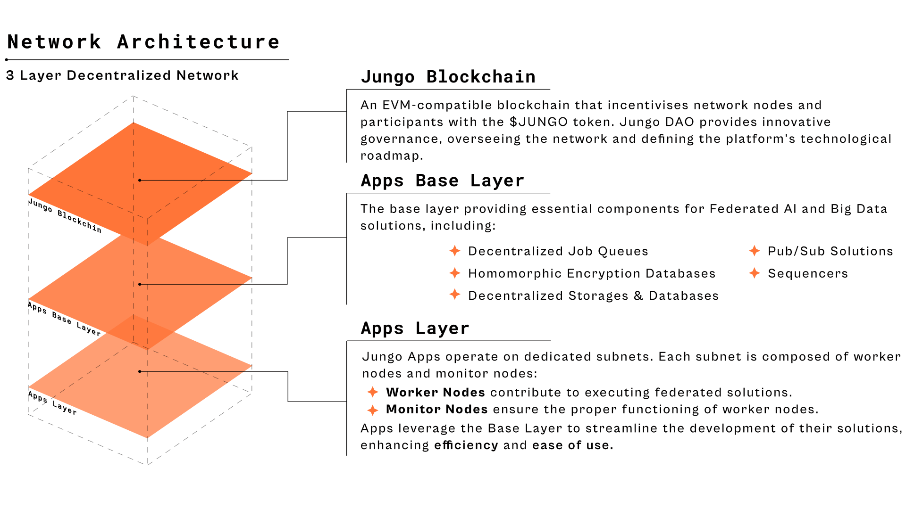

# Introduction

Blockchains, as the primary infrastructure for developing decentralized solutions, serve as excel-
lent trustless databases. However, they struggle to handle two critical aspects required by technolo-
gies like AI: Big Data and computation. The goal of JungoAI is to provide a collaborative solution
for Big Data and computation, leading to a more effective decentralized AI and data platform.

## Federated AI

Most AI algorithms are designed to be centralized. Data and computation need to be in a centralized
location, which means only large organizations with the resources to collect vast amounts of data
and sufficient computational power can develop these solutions.

The major drawback of centralized AIs is the presence of a single authority, which can lead to
models trained on biased data, resulting in biased outcomes. Additionally, similar to the dominance
of search engines over the past decades, only a few entities can possess the technology and reap
the benefits. Platforms like [Bittensor](https://bittensor.com) attempt to leverage blockchain technology to incentivize
experts, entities, and node operators to participate in developing AI solutions. However, these
platforms function more like marketplaces and competitive AI solutions. At JungoAI, our goal is to
build a Federated AI solution where network nodes collaborate to provide data and computation.

## Federated Big Data

Federated Big Data is an innovative approach to managing and analyzing large datasets across
multiple decentralized locations. Unlike traditional centralized systems, where data is collected and
processed in a single location, federated big data leverages the power of distributed networks to
enhance privacy, scalability, and collaboration.

JungoAI’s goal is to provide a protocol that enables public nodes to participate in delivering
big data solutions for various real-world applications, including indexing and analyzing blockchains,
collecting and analyzing web data, and more.

## Problem

  

## Solution

  

