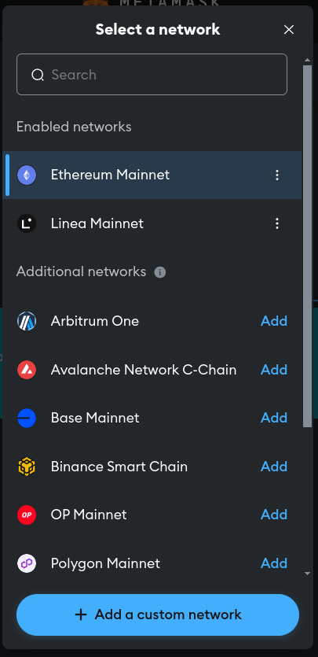
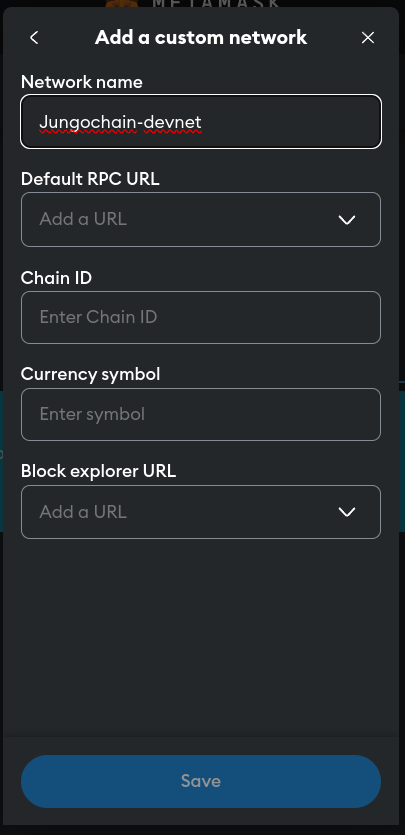
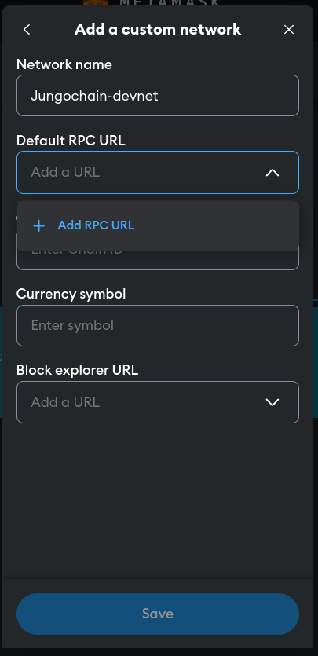
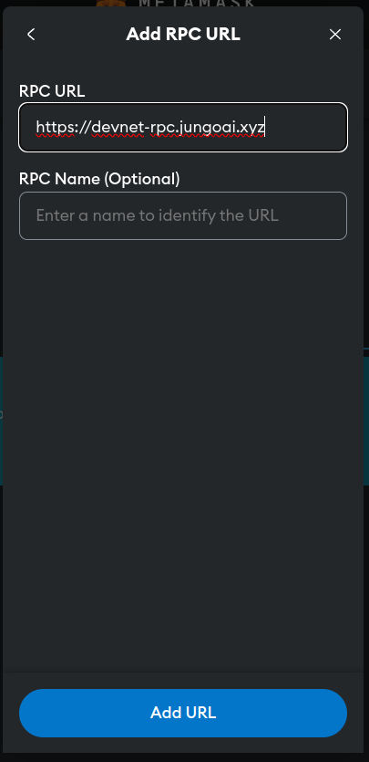
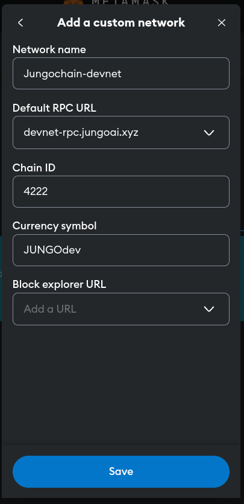
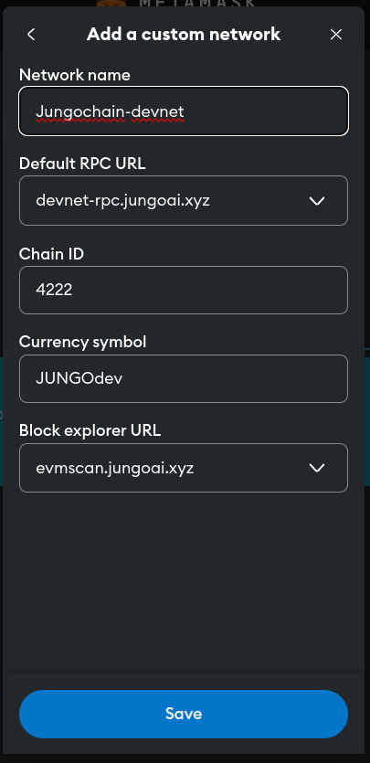
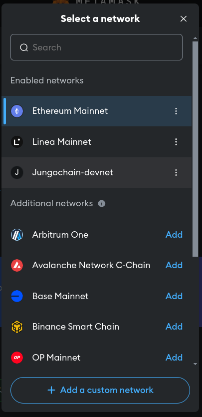

# Add to Metamask

Here we explain how to add Jungochain network to your Metamask wallet.

Click on the button of top left corner of your Metamask and then a pop-up like below would appear.

  

Click on "Add a custom nework" button.

  

Fill the Network name, for example "Jungochain-devnet".

  

Click on "Add RPC URL".

  

Fill the RPC URL with `https://devnet-rpc.jungoai.xyz`.

  

Fill ChainID with `4222` (JungoAI devnet EVM chain id is 4222) and Currency symbol with `JUNGOtest` (for clarification it's devnet token).

  

Fill the Block explorer URL with "https://evmscan.jungoai.xyz".

  

You should see Jungochain-devnet in your network list. Select it.

That's it. You should be able to send and receive JUNGO token.
