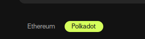

# Add to Talisman

Talisman is an Ethereum and Polkadot, you can manage both addresses.

Here we explain how to add Jungochain-devnet to Polkadot networks of Talisman. 

First of all, you can get Talisman from [here](https://talisman.xyz/).

Go to the Setting tab and select "Networks & Tokens" and then select "Manage Networks":

Select "Polkadot" tab:

Click on "Add network" button:

Fill the inputs like below:

As you can see, token name (`JUNGOtest`) and decimals `9` filling up automatically.

Click on "Add Network". Now you can send and receive `JUNGOtest` token.
