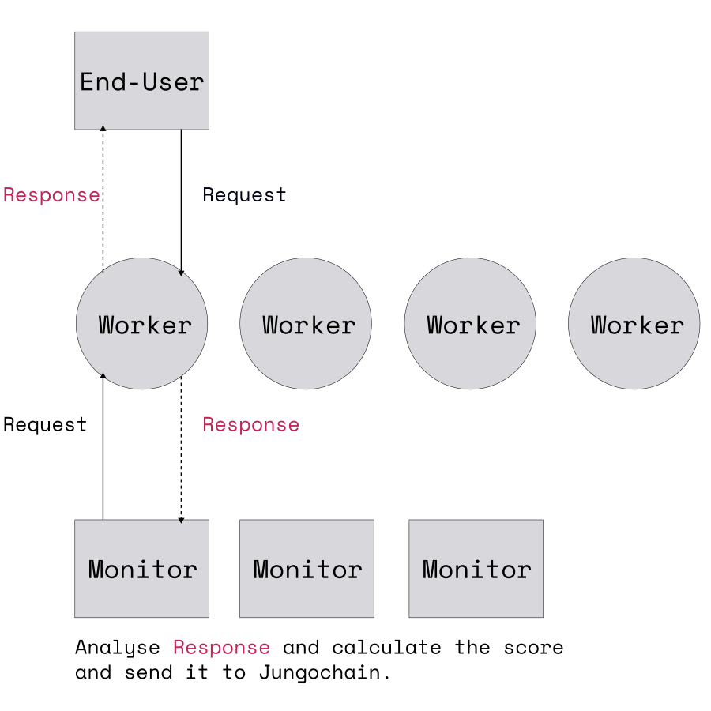

# JungoAI Componenets

JungoAI consisted of this components:

Main Components of JungoAI ecosystem would be:

- Jungochain
- Subnet
  - Worker node
  - Monitor node

## Jungochain

Jungochain is the blockchain layer of JungoAI.

It handles transactions and serve Subnets, store information and metadata of 
Subnet itself and each nodes (worker or monitor), And incentivize them utilizing JUNGO token. 
You can find out how emission will distribute [here]().

To get more details checkout [terminologies](../more/terminologies.md)

## Subnet

A Subnet is a subnetwork under Jungochain, running an AI or Big Data service.

Everyone can run a Subnet on Jungochain by staking amount of JUNGO token, 
set configuration parameters and define the service API (to be used by the end-user).
After than other persons can run Worker and Monitor nodes that follow 
the rules (service API and configuration) on the subnet and get emission too.

*How Subnet works:*

Subnet is made of Worker nodes and Monitor nodes.

### Worker

Is actual node that run Big Data or AI service and serve end-user.

### Monitor

A Monitor analyze performance of Workers and send result (scores of Workers) back to the Jungochain. 
Then Jungochain distribute reward among Workers according to it.
A Monitor also gets reward according to the average of Monitor results.
See [emission](../more/emissions.md) section for more details.

Here is a diagram of a Subnet:

  

And Here is an overview of JungoAI ecosystem:

  

For running subnet nodes see [here](guide/run-a-subnet-node.md).

Or if you want to create a new Subnet see [here]().
